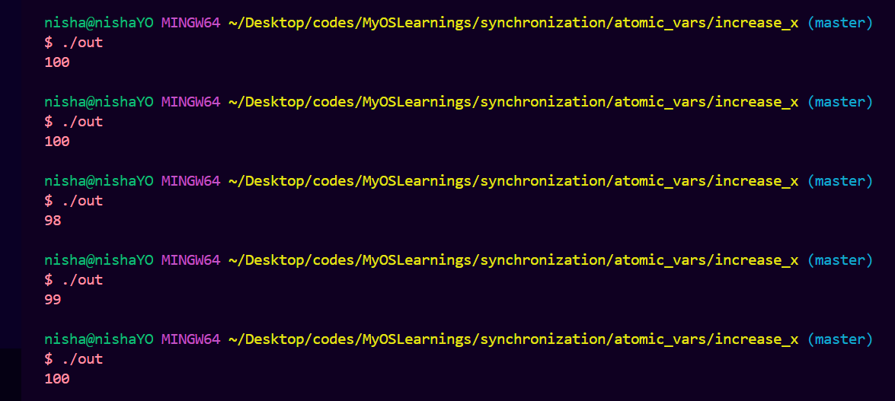

I am practicing the concepts of operating systems in this repo. 

- Compare_performance dir compares the nature and performance of python, nodejs and golang.
- synchronization dir has different sync tools provided by golang sync package to avoid data racing conditions. Currently implemented ones are atomic variables and mutex. 

- an example of two scripts 
- 1st producing non deterministic output due to racing conditions

- 2nd producing deterministic output due to proper synchronization practice.
